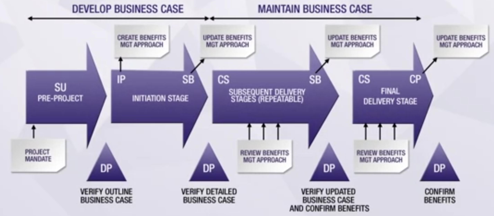

# Preparation guide for the Prince 2 foundation's exam:

I have 4 days to prepare the exam of Prince 2 foundation. Starting from scratch, I will share with you my journey.

# Day 1: Knowing the principles

### What is Prince 2?

PRINCE2 (PRojects IN Controlled Environments) is a structured project management method and practitioner certification programme. PRINCE2 emphasises dividing projects into manageable and controllable stages. (https://en.wikipedia.org/wiki/PRINCE2). Industry standard method for managing projects, updated in 2002, 2005, 2009, 2017.

The six aspects of Prince 2 are the following:
- Scope
- Time scale
- Risk
- Cost
- Quality
- Benefits

Te four integrated elements of the Prince 2 structure are:
- The principles
- The Themes
- The processes
- And the project environment.

### The seven principles:
These principles needs to be used in all Prince 2 projects, these are the pillar of each Prince 2 project. There are Universal, Self-validating and Empowering.
The seven principles of Prince 2 are the following:
- Continued Business justification
- Learn by experience
- Defined roles and responsibilities
- Manage by stages: A Prince2 project is planned, monitored and controlled on a stage by stage basis.
- Manage by exception: A Prince2 project has defined tolerances for each project performance target to establish limits of delegated authority.
- Focus on products: A Prince2 project focuses on the definition and delivery of products, in particular their quality requirements.
- Tailored on project environment

### The seven Themes: 
- Business Case
- Organisation
- Quality
- Plans
- Risk
- Change
- Progress

Business case and risk support the principle of continued business justification.

The organization theme supoort the principle for roles and responsibilities to be clearly defined by establishing an organization structure.

The quality theme establish common understanding of scope and quality criteria. It ensures products are fit for purpose, meet business expectations and enable benefits to be achieved

The plan theme supports several principles including managing by stages, focus on products and manage by exception. It answers the questions: What's required, where and how. When and by Whom.

The progress theme supports the following principles: Manage by stages, continued business justification, learn from experience and manage by exception.

By managing changes to progress in a controlled ways, the change theme supports the principle manage by exception and focus on products.

## The seven processes:
It addresses the chronological flow of the project. Each process includes activity that drives the project forward.

- Starting up the project
- Initiating (defining the Project Initiation Document)
- Directing the project: How the project management team oversees the project
- Controlling a stage: Dictates how each individual stage should be controlled, including the way in which work packages are authorised and distributed
- Managing Product delivery
- Managing Stage boundaries: How to transition from one stage to another
- Closing up the project

One aim of Prince 2 is to make the right information available at the right time for the right people to make the right decisions about the project. Those decisions include whether to take corrective action or iplement measures to improve performance.

## Why Prince 2?
- Proven best practice and governance
- Project viability/business case focus
- Can be applied to any type of project
- Provides a common language for participans
- Product focus and their quality requirements
- Explicit recognition of project responsibilities
- Improved communication and control through plan levels
- Promotes learning and continuous improvement in organizations

## Some reasons why projects fail:
- Lack of good business reasons for undertaking the work
- Repeated mistakes
- Failure to involve the customers throughout the project
- Lack of good business reasons for undertaking the work
- Lack of quality requirements and measurable acceptance criteria
- Poorly specified & understood project objectives
- Products not defined in sufficient detail before starting work
- No proper system for capturing & managing changes
- Unclear roles, responsibilities and leadership

## Addressing project failure
- what to be achieved & where
- Why (The business benefits of the undertaking, the major risks facing the project)
- HOW will the work be done
- WHO needs to be involved, to do what
- WH EN do people need to be involved
- HOW LONG will the work take
- HOW MUCH will it cost
- WHAT additional resources are needed, external factors impact on the work and the desired outcome(s)

## What is a programme?
Project focus on product or output or delivery capabilities for achieving benefits. Program management is focused on managing those benefits to ensure maximum gains is achieved for the organization. 
Program management provides a framework to co-ordinate, direct and oversee the implementation of a set of related projects and activities in order to deliver outcomes and benefits related to the organization0s strategic objectives.
A programme is likely to have a life that spans several years.

## What is a portfolio?
A portfolio is the totality of an organization's investment (or segment thereof) in the changes required to achieve its strategic objectives.
Portfolio may comprise:
- Projects
- Programmes
- Other work (possibly not interdependent or directly related) but must contribute to the strategic objectives.

# Starting up a project and initiating a project

Initiating a project process tasks are the following:
- Define the tailoring requirements
- Prepare the risk management approach
- Prepare the change control approach
- Prepare the quality management approach
- Prepare the communication management approach
- Set up project controls
- Create the project plan
- Refine the business case
- Assemble the PID

The PID should act as a base plan for managing a project. It's the outcome of the initiating phase. 

# Controlling a stage and managing product delivery

# Business case theme (related to Continued Business Justification)
Projects are undertaken to generate measurable business improvements (benefits), enabled by outputs and outcomes:
- Output: Any of the project's specialist products (tangible or intangible)
- Outcome: The result of change; affecting real-world behaviour and/or circumstances
- Benefit: The measureable improvement resulting from an outcome
- Dis-benefit: An outcome perceived as negative by one or more stakeholders... (An actual consequence not a risk)

## Type of business cases_
- Compulsory project. eg. change in legislation
- Not-for-profit. eg. Social care
- Evolving project. eg. Research and prototyping
- Customer/supplier project ...

The project board executive is responsible of preparing the business case.
The business justification for a project should include not only the costs of developing the products produced by the project, but also for any changes to operational costs post-project. This is added to the detailed business case during initiation stage.

*Business case development path and benefits management approach*

## Benefit management approach
Used to define how and when a measurement of the achievement of the project's benefits expected by the Senior User(s) can be made. It's also used during project closure to define any post-project benefit reviews that are required.
1. Produced in IP (Initiation phase)
2. Approved in DP (Directing a project)
3. Updated in SB (Stage Boundary)
4. Approved in DP
5. Updated in CP (Closing a Project)
6. Approved in DP

## Tailoring business case:
Simple project may need a simple document. Sometimes, a business case cannot be clearly defined, particularly in an evolving project.
A feasibility study project may have multiple business cases considered. There should always be a business case to justify the starting or the continuation of a project.

# Risk theme (Continued Business Justification)
A risk is defined as uncertain events that would have a negative impact on objectives. The difference between a risk and an issue is that a risk is an uncertainty meanwhile an issue is a certainty, an event that has or will eventually occur.

Risk must be clearly described to ensure understanding of:
- Risk cause: describes the risk source (event/situation), the risk trigger points
- Risk Event: Describes the area of uncertainty
- Risk effect: Describes impact(s) on objectives

  ## Risk register
  It provides a record of identified risks relating to the project, including their status and history. It is used to capture and maintain information on all the identified threats and opportunities relating to the project. The information on any risk should be updated regularly to record any changes in status.
  The RR is produced in IP for input to PID. The risks should be recorded in a daily log. The risks should be reviewed and approved by the project board in DP.

  ## Risk management procedure technique
  There are 5 steps in each risk management procedure:
  - Identify (context and risks)
  - Assess the risks that had been identified (Estimate the probability of the risk to occur)
  - Plan: Specific responses are evaluated
  - Implement: Ensure that the responses are actually cared out. 
  - Communicate: Is carried out continually to keep the team informed.

## Risk response types
Identifying and evaluating the appropriate risk response to remove or reduce threats, and to maximize opportunities
Risk response types:
- Avoid (For threats)
- Reduce (For threats)
- Exploit (For opportunities)
- Enhance (For opportunities)
- Prepare contingent plan (Plan B)
- Transfer the impact of the risk to a third party
- Share
- Accept (acknowledge that the risk exist)

## Risk budget
Sum of money as part of project's budget

# Plan theme
The PT supports the principles **focus on products, manage by stages, manage by exception**. 
A plan is a document describing how, when and by whom a specific target or set of targets is to be achieved. It's the backbone of the management information system.

Planning is the process of making or maintainin a plan. Prince2 requires a product-based approach to planning.

## Levels of plan
- Project plan (Created by the PM)
- Stage plans and exception plans
- Team plans (are optional)

Plans need to be writing with a certain types of details for each phase. It needs to be prepared at the end of each stage of a project using the SB process. A project plan should cover the entire life cycle of the project.

## Approach to product-based planning
1. Designing a plan: Cared out once during the initiation stage
2. Defining and analysing the products
3. Identifying activities and dependencies
4. Preparing estimates
5. Preparing a schedule
6. Documenting a plan

Steps 2 to 6 should be repeated for project plan, stage plan and team plan (optional).

## MoSCoW Prioritization Technique
- Must have: Essential and critical to business justification
- Should have: Important but not critical. Absence weakens business justification
- Could have: Useful but NOT critical. Absence doesn't weaken business justification
- Won't have: Defines what has been considered, but will NOT be delivered

# Quality theme

# Resources:
- Spoce 's training guide for Prince2 foundation 2017